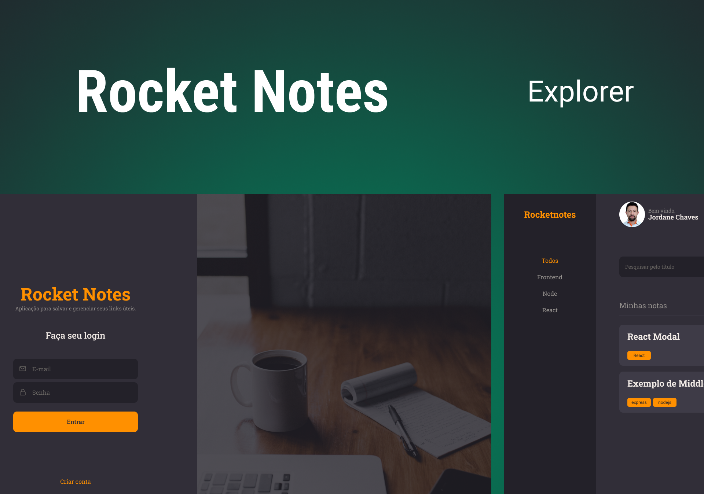

<h1 align="center">Rocket Notes</h1>

Explorer | Stage 09 - Rocket Notes

  <a href="#-tecnologias">Tecnologias</a>&nbsp;&nbsp;&nbsp;|&nbsp;&nbsp;&nbsp;
  <a href="#-projeto">Projeto</a>&nbsp;&nbsp;&nbsp;|&nbsp;&nbsp;&nbsp;
  <a href="#-como-executar">Como Executar</a>&nbsp;&nbsp;&nbsp;|&nbsp;&nbsp;&nbsp;
  <a href="#-licença">Licença</a>&nbsp;&nbsp;&nbsp;|&nbsp;&nbsp;&nbsp;
  <a href="#autor">Autor</a>

  

 

  

## 🚀 Tecnologias

Esse projeto foi desenvolvido com as seguintes tecnologias:

- JavaScript
- ReactJS
- Styled Components
- React Router Dom
- Vite

## 💻 Projeto

Rocket Notes é uma aplicação para cadastrar e controlar notas pessoais.

## 🎲 Como executar

1. Clone este repositório.
2. Instale as dependências com `npm install`
3. Execute o servidor com `npm run dev`

## 📝 Licença

Esse projeto está sob a licença MIT.

## Autor

 

Feito com 💜 por Jordane Chaves
